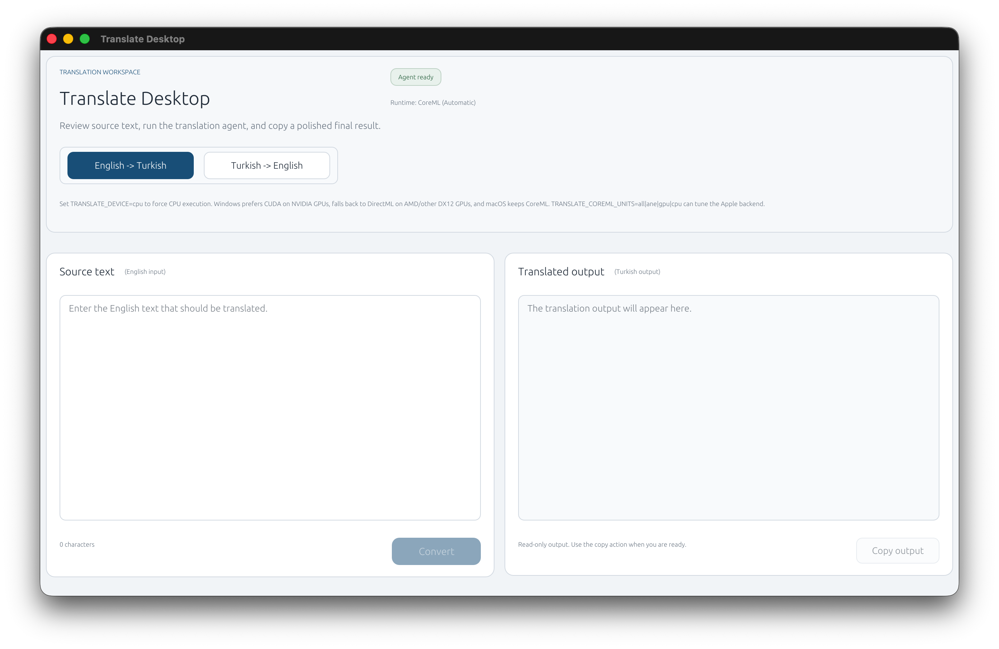

<h1 align="center">🌍 LocalTranslateApp</h1>

<p align="center">
  English ↔ Turkish translation app. Runs completely offline — internet is only needed the first time to download the model.
</p>

<p align="center">
  
  
</p>

<p align="center">
  
</p>

## ✨ Features

- **Local Translation**: All translation happens on your device
- **Bidirectional**: English → Turkish and Turkish → English
- **Platform Acceleration**: CUDA on NVIDIA Windows systems, DirectML on other Windows GPUs, CoreML on macOS
- **Modern UI**: Clean and easy-to-use desktop interface

## 🚀 Installation

### Requirements

- Windows 10/11 or macOS
- Rust (1.75+)
- (Optional) NVIDIA GPU with CUDA-capable drivers on Windows for best performance, otherwise a DirectX 12 GPU, or Apple GPU / Neural Engine support on macOS

### Build

```bash
# Clone the repository
git clone https://github.com/kodzamani/LocalTranslateApp.git
cd LocalTranslateApp

# Build and run
cargo run --release
```

### 🎮 NVIDIA CUDA GPU Acceleration (Windows)

If you want to use CUDA-based GPU acceleration on an NVIDIA graphics card, you need to install the following tools and configure the required environment variables. If these steps are not completed, the application will automatically fall back to DirectML or CPU.

#### 1. Install CUDA Toolkit 12.x

Download and install **CUDA Toolkit 12.x** from the official NVIDIA website:

👉 [https://developer.nvidia.com/cuda-downloads](https://developer.nvidia.com/cuda-downloads)

- You can accept the default settings during installation.
- After installation, verify that the `CUDA_PATH` environment variable has been set automatically:

```powershell
echo %CUDA_PATH%
# Expected output: C:\Program Files\NVIDIA GPU Computing Toolkit\CUDA\v12.x
```

#### 2. Install cuDNN 9.x

Download **cuDNN 9.x** from the NVIDIA cuDNN page:

👉 [https://developer.nvidia.com/cudnn](https://developer.nvidia.com/cudnn)

- Copy the files from the downloaded archive into your CUDA Toolkit directory:
  - `bin\*.dll` → `%CUDA_PATH%\bin\`
  - `include\*.h` → `%CUDA_PATH%\include\`
  - `lib\x64\*.lib` → `%CUDA_PATH%\lib\x64\`

#### 3. PATH Environment Variable

Make sure the following directories are included in your `PATH` environment variable so that the CUDA and cuDNN libraries can be found:

```
C:\Program Files\NVIDIA GPU Computing Toolkit\CUDA\v12.x\bin
C:\Program Files\NVIDIA GPU Computing Toolkit\CUDA\v12.x\libnvvp
```

> 💡 The CUDA Toolkit installer usually adds these directories to `PATH` automatically, but it is recommended to verify.

#### 4. Verify Installation

You can verify that everything is installed correctly by running the following commands:

```powershell
# Check NVIDIA driver and CUDA version
nvidia-smi

# Check CUDA compiler version
nvcc --version
```

At startup, the application looks for `nvcuda.dll` (shipped with the NVIDIA driver) and `cudart64_12.dll` (shipped with the CUDA Toolkit). If either library cannot be loaded, an error message is printed to the terminal and written to `cuda_error.log` next to the executable, and the application falls back to DirectML.

#### ⚠️ Important Notes

- CUDA acceleration is **only supported on Windows**.
- Your NVIDIA driver must be compatible with **CUDA 12.x**. You can download the latest driver from [NVIDIA Driver Downloads](https://www.nvidia.com/Download/index.aspx).
- On macOS, GPU acceleration is handled automatically via CoreML — no additional setup is required.
- On any platform, you can force CPU-only execution by setting the `TRANSLATE_DEVICE=cpu` environment variable.

---

## 📖 Usage

### 🎬 Demo

<video src="https://github.com/kodzamani/LocalTranslateApp/raw/main/docs/HowToUse.mp4" controls autoplay loop muted width="100%"></video>

### Steps

1. Launch the app
2. Select source language (English or Turkish)
3. Enter the text you want to translate
4. Click "Translate"

On first run, the model will be downloaded automatically (approximately 500MB).

## 🛠️ How It Works

- **Model**: [OPUS-MT](https://huggingface.co/Helsinki-NLP) transformer model
- **Runtime**: ONNX Runtime with CUDA or DirectML on Windows, CoreML on macOS
- **UI**: Rust + eframe (egui)

## ⚙️ Runtime Notes

- `TRANSLATE_DEVICE=cpu` forces CPU execution on every platform.
- Windows prefers `CUDA` on NVIDIA hardware, then falls back to `DirectML`, then CPU if GPU providers cannot start.
- On macOS, `TRANSLATE_COREML_UNITS=all|ane|gpu|cpu` selects the preferred CoreML compute units.
- `TRANSLATE_COREML_FORMAT=mlprogram|neuralnetwork` selects the CoreML compiled model format for debugging compatibility issues.
- `TRANSLATE_COREML_STATIC_INPUT_SHAPES=1` limits CoreML to static-shape subgraphs, which can help isolate dynamic-shape failures.
- `TRANSLATE_COREML_PROFILE_PLAN=1` asks CoreML to log which hardware each delegated operator uses.
- `TRANSLATE_COREML_DEBUG=1` prints session I/O metadata plus encoder/decoder tensor shapes and token ranges before inference.
- `TRANSLATE_COREML_CACHE=0` disables the CoreML compile cache while debugging configuration changes.
- CoreML sessions use a local compile cache under `~/Library/Caches/LocalTranslateApp/coreml` to reduce repeated startup cost.

## 📝 License

MIT License - See [LICENSE](LICENSE) file for details.
